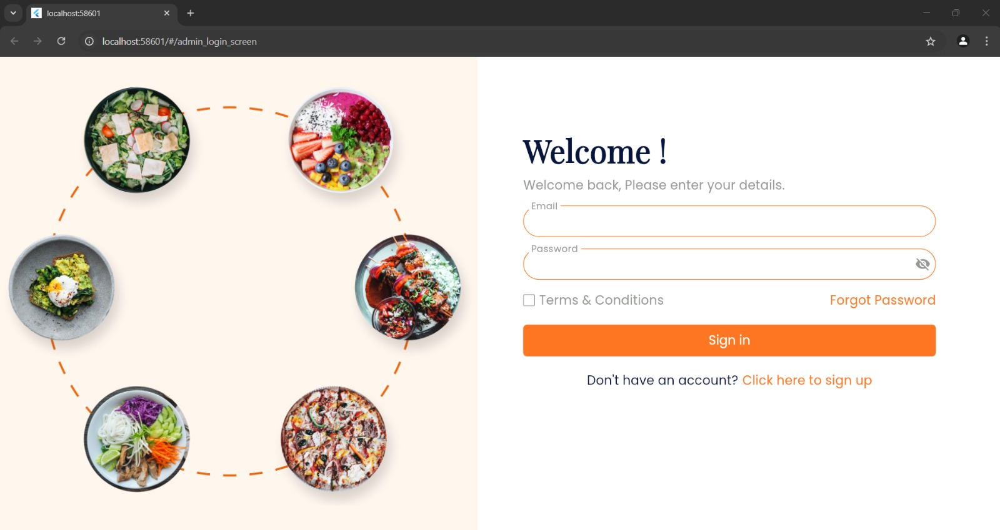
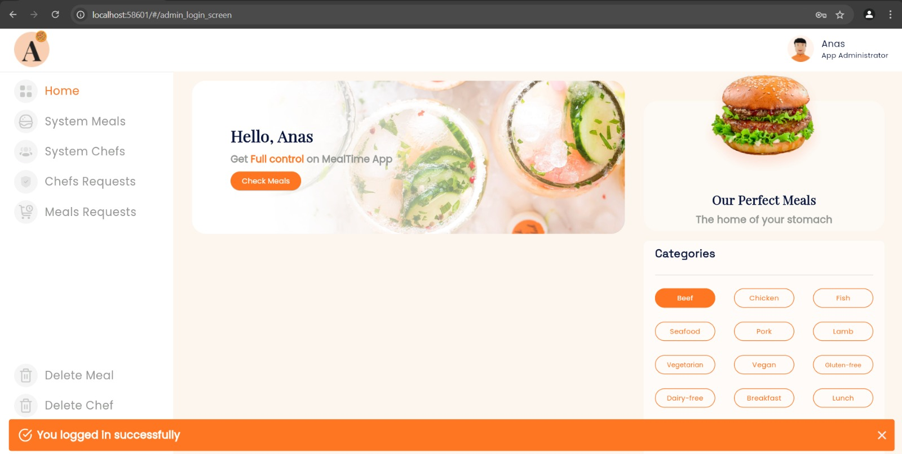
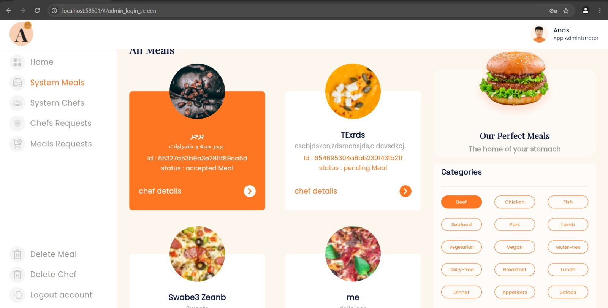
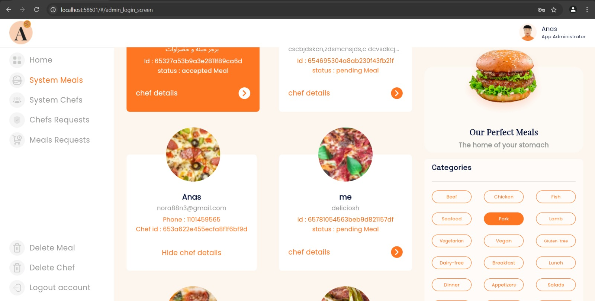
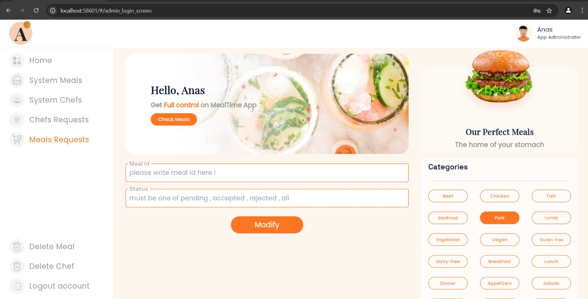
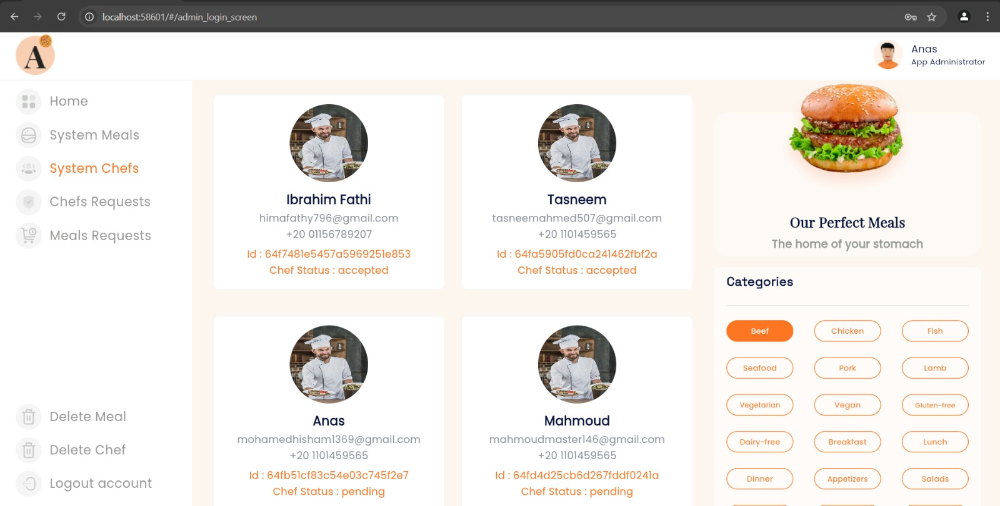
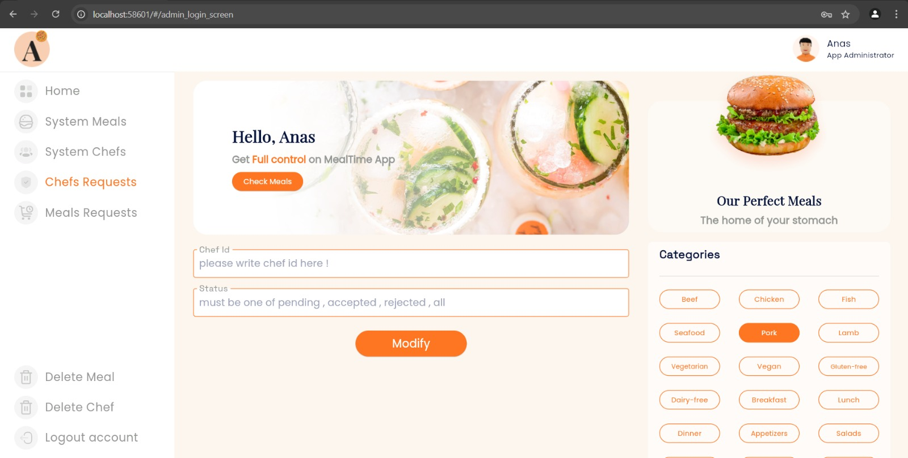
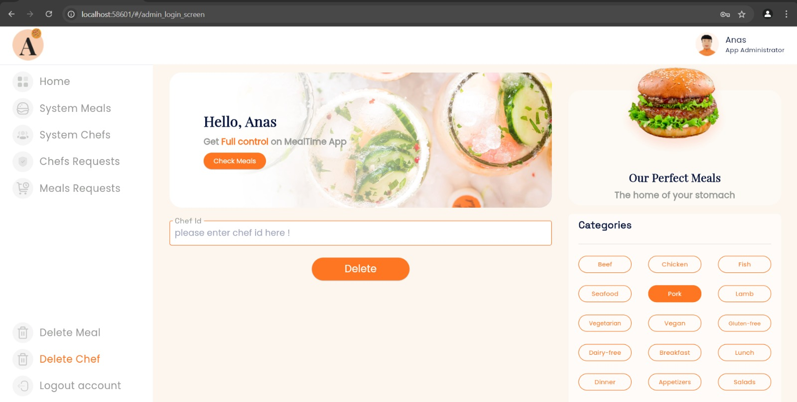
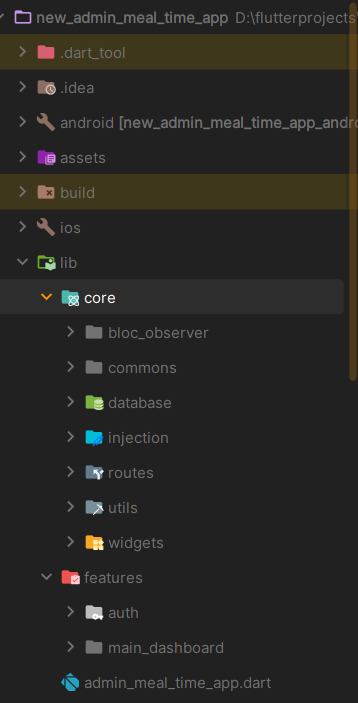
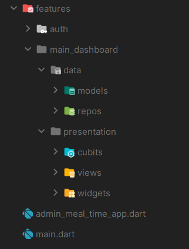

# 🛠️ MealTime Admin Dashboard

A powerful and scalable **Web-based Admin Dashboard** designed to manage the MealTime food service app efficiently.
It provides full control over meals, users, and system content with a clean and intuitive interface.

---

## 🚀 Overview

The MealTime Admin Dashboard enables administrators to monitor and control the entire system from a single place.

It ensures:

* High-quality content through approval workflows
* Efficient user management
* Fast and responsive system control

---

## 🚀 Features

## 🍽️ Meals Management

* View all meals in a structured list

* Filter meals by status:

  * ⏳ Pending
  * ✅ Accepted
  * ❌ Rejected

* Review meal details:

  * Name
  * Description
  * Price
  * Image

* Approve or reject meals submitted by users

* Update meal status easily

* Edit meal data or update images

* Delete meals when needed

---

## 👥 Users Management

* View all registered users
* Access detailed user information
* Approve or reject new users
* Block or delete users

---

## ⚙️ Technical Features

* 🎯 User-friendly and clean UI
* ⚡ Real-time data updates
* 🏗️ Scalable architecture
* 📊 Structured data handling for better performance

---

## 💡 Value Proposition

✔ Full control over the entire system
✔ Content moderation before publishing
✔ Reduces errors and invalid content
✔ Suitable for:

* E-commerce systems
* Food platforms
* Any user-generated content platform

---

## 🏗️ Architecture

* Modular & scalable structure
* MVVM design pattern principles
* API-driven system
* State management (Bloc/Cubit)

---

## 📱 Screenshots

> 📌 The following screens showcase the main dashboard sections including meals moderation, user management, and system overview.

---

### 🔐 Authentication

| Login                                     |
| ----------------------------------------- |
|  |

---

### 🏠 Dashboard Overview

| Home                                       |
| ------------------------------------------ |
|  |

---

### 🍽️ Meals Management

| System Meals                                       | System Meals (Alt)                                  |
| -------------------------------------------------- | --------------------------------------------------- |
|  |  |

---

### ⏳ Meals Requests

| Meal Requests                                        |
| ---------------------------------------------------- |
|  |

---

### 👨‍🍳 Chefs Management

| System Chefs                                       | Chef Requests                                        |
| -------------------------------------------------- | ---------------------------------------------------- |
|  |  |

---

### 🚫 User Actions

| Delete Chef                                       |
| ------------------------------------------------- |
|  |

---

## 🎥 Demo
Check out the full demo of **MealTime Dashboard** here: [Watch Demo Video](https://youtu.be/dKHf_uGSr-s)

---

---

## 🏗️ Project Structure
> 📌 The project follows a clean and scalable **feature-based architecture** using Flutter & Bloc.

---

### 🧩 Overall Architecture

---

### 🧱 Feature Structure Example

---

---

> 💡 This structure ensures scalability, maintainability, and separation of concerns, making the app easy to extend and manage.

---

## 🔗 Related Project

* 📱 MealTime Mobile App
  (https://github.com/khaled365-code/MealTime_App_V_2.0.0)

---

## 💻 Tech Stack

* Flutter
* Dart
* Bloc
* API Integration
* MVVM Architecture
* Animations

---

## ⭐ Highlights

* Real-time control
* Scalable architecture
* Clean UI/UX
* Production-ready

---

---
